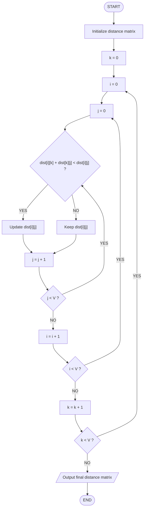

# Floyd–Warshall Algorithm — Visualizing All-Pairs Shortest Paths

> **"What if the shortest path between two vertices is not the direct path, but a path through another vertex?"**

The Floyd–Warshall algorithm answers this question systematically.

Instead of finding the shortest path from one source to one destination, Floyd–Warshall finds the **shortest paths between every pair of vertices** in a weighted graph.

This project visualizes how the algorithm progressively improves a distance matrix by considering each vertex as a possible intermediate vertex.

---

## 1. Motivation

Imagine a transportation network connecting several cities.

There may be a direct road from:

```text
A → C
```

but that road might not be the fastest way to travel. Perhaps:

```text
A → B → C
```

is shorter.

For a small graph, we might manually try different routes. But what happens when there are hundreds or thousands of vertices?

We need a systematic way to answer:

> What is the shortest distance from every vertex to every other vertex?

This is the problem solved by the Floyd–Warshall algorithm.

---

## 2. The Problem

Given a weighted graph containing `V` vertices, we want to determine:

```text
shortest distance(i, j)
```

for every possible pair of vertices `i` and `j`.

For example, with four vertices `A, B, C, D`, we want to know:

```text
A → A    A → B    A → C    A → D
B → A    B → B    B → C    B → D
C → A    C → B    C → C    C → D
D → A    D → B    D → C    D → D
```

The result is naturally represented using a **distance matrix**.

---

## 3. Why a Distance Matrix?

A distance matrix stores the shortest known distance between every pair of vertices.

The entry `dist[A][C]` means: *the currently known shortest distance from A to C.*

Initially, the matrix contains the direct edge weights. As Floyd–Warshall runs, these values can improve.

---

## 4. Our Example Graph

We use four vertices `A, B, C, D` with the following weighted edges:

| Edge  | Weight |
|-------|--------|
| A → B | 3 |
| A → C | 7 |
| B → A | 3 |
| B → C | 2 |
| B → D | 4 |
| C → A | 7 |
| C → B | 2 |
| C → D | 1 |
| D → B | 4 |
| D → C | 1 |

There is no direct edge between A and D, therefore:

```text
A → D = ∞
D → A = ∞
```

The graph contains edges in both directions for the listed connections, so it can be viewed as an undirected weighted graph represented through directed edges.

---

## 5. Initial Distance Matrix

Rules for building the initial matrix:

1. Distance from a vertex to itself is `0`.
2. If there is a direct edge, use its weight.
3. If there is no direct edge, use `∞`.

|       | A | B | C | D |
|-------|---|---|---|---|
| **A** | 0 | 3 | 7 | ∞ |
| **B** | 3 | 0 | 2 | 4 |
| **C** | 7 | 2 | 0 | 1 |
| **D** | ∞ | 4 | 1 | 0 |

At this point, these are only the direct distances. They are not necessarily the final shortest distances.

For example, `A → C = 7`, but perhaps we can find a shorter route through `B`.

---

## 6. The Key Idea

This is the heart of Floyd–Warshall. For every pair of vertices `i` and `j`, we ask:

> Would going from `i` to `j` through an intermediate vertex `k` be shorter?

There are two possibilities.

**Option 1 — Existing path**

```text
i ─────────→ j        distance: dist[i][j]
```

**Option 2 — Path through k**

```text
i ──→ k ──→ j         distance: dist[i][k] + dist[k][j]
```

We choose whichever is smaller:

```text
dist[i][j] = min(
    dist[i][j],
    dist[i][k] + dist[k][j]
)
```

This single equation is the heart of the entire algorithm.

---

## 7. What Do i, j, and k Mean?

| Variable | Role |
|----------|------|
| `i` | source vertex |
| `j` | destination vertex |
| `k` | intermediate vertex |

When we write `dist[i][j]`, we are asking: *what is the shortest distance from i to j?*

When we calculate `dist[i][k] + dist[k][j]`, we are asking: *what if I travel from i to j through k?*

---

## 8. Why Do We Need Three Loops?

Floyd–Warshall uses three nested loops.

```text
for k
    for i
        for j
            update dist[i][j]
```

| Loop | Variable | Purpose |
|------|----------|---------|
| Outer | `k` | Progressively allow different vertices to become intermediate points |
| Middle | `i` | Consider every possible source |
| Inner | `j` | Consider every possible destination |

The algorithm checks every possible combination.

---

## 9. Step 0 — Initial State

|       | A | B | C | D |
|-------|---|---|---|---|
| **A** | 0 | 3 | 7 | ∞ |
| **B** | 3 | 0 | 2 | 4 |
| **C** | 7 | 2 | 0 | 1 |
| **D** | ∞ | 4 | 1 | 0 |

Now we begin the algorithm.

---

## 10. Step 1 — Allow A as an Intermediate Vertex

Now `k = A`. We ask: *can going through A make any path shorter?*

For every pair `(i, j)` we calculate `dist[i][A] + dist[A][j]` and compare it with `dist[i][j]`.

**Example:** consider `B → C`.

- Current distance: `B → C = 2`
- Through A: `B → A → C = 3 + 7 = 10`
- Compare: `10 < 2`? **No.**

Therefore `B → C` remains `2`.

After checking all pairs, no shorter paths are discovered through A, so the matrix is unchanged:

|       | A | B | C | D |
|-------|---|---|---|---|
| **A** | 0 | 3 | 7 | ∞ |
| **B** | 3 | 0 | 2 | 4 |
| **C** | 7 | 2 | 0 | 1 |
| **D** | ∞ | 4 | 1 | 0 |

---

## 11. Step 2 — Allow B as an Intermediate Vertex

Now `k = B`. This is where interesting changes occur. We ask: *can going through B make any route shorter?*

**Example 1: A → C**

- Current: `A → C = 7`
- Through B: `A → B → C = 3 + 2 = 5`
- `5 < 7` — **Yes!** So `A → C = 5`.

**Example 2: A → D**

- Current: `A → D = ∞`
- Through B: `A → B → D = 3 + 4 = 7`
- `7 < ∞` — **Yes!** So `A → D = 7`.

**Example 3: C → A**

- Current: `C → A = 7`
- Through B: `C → B → A = 2 + 3 = 5`
- `5 < 7` — **Yes!** So `C → A = 5`.

**Example 4: D → A**

- Current: `D → A = ∞`
- Through B: `D → B → A = 4 + 3 = 7`
- `7 < ∞` — **Yes!** So `D → A = 7`.

After considering B, the matrix becomes:

|       | A | B | C | D |
|-------|---|---|---|---|
| **A** | 0 | 3 | **5** | **7** |
| **B** | 3 | 0 | 2 | 4 |
| **C** | **5** | 2 | 0 | 1 |
| **D** | **7** | 4 | 1 | 0 |

Notice what happened. The algorithm did not manually search through every possible route. It simply asked *"Is going through B cheaper?"* for every pair.

---

## 12. Step 3 — Allow C as an Intermediate Vertex

Now `k = C`. Again, we check every pair. This step produces more improvements.

**Example 1: A → D**

- Current: `A → D = 7`
- Through C: `A → C → D = 5 + 1 = 6`
- `6 < 7` — **Yes!** So `A → D = 6`.

The best known route is now `A → B → C → D` with total distance `3 + 2 + 1 = 6`.

**Example 2: D → A**

- Current: `D → A = 7`
- Through C: `D → C → A = 1 + 5 = 6`

Here we use the **updated** value `C → A = 5` found in the previous step. Since `6 < 7`, `D → A = 6`.

**Example 3: B → D**

- Current: `B → D = 4`
- Through C: `B → C → D = 2 + 1 = 3`
- `3 < 4` — **Yes!** So `B → D = 3`.

Similarly, `D → B = 3`.

After using C as an intermediate vertex:

|       | A | B | C | D |
|-------|---|---|---|---|
| **A** | 0 | 3 | 5 | **6** |
| **B** | 3 | 0 | 2 | **3** |
| **C** | 5 | 2 | 0 | 1 |
| **D** | **6** | **3** | 1 | 0 |

At this point, every entry represents a shortest distance found so far.

---

## 13. Step 4 — Allow D as an Intermediate Vertex

Finally `k = D`. We once again check every pair. The algorithm asks: *can going through D make any path shorter?*

For this particular graph, no further improvement is found, so the matrix remains:

|       | A | B | C | D |
|-------|---|---|---|---|
| **A** | 0 | 3 | 5 | 6 |
| **B** | 3 | 0 | 2 | 3 |
| **C** | 5 | 2 | 0 | 1 |
| **D** | 6 | 3 | 1 | 0 |

This is our final shortest-path matrix.

---

## 14. Final Result

|       | A | B | C | D |
|-------|---|---|---|---|
| **A** | 0 | 3 | 5 | 6 |
| **B** | 3 | 0 | 2 | 3 |
| **C** | 5 | 2 | 0 | 1 |
| **D** | 6 | 3 | 1 | 0 |

For example:

- `A → C = 5` because `A → B → C = 3 + 2 = 5`
- `A → D = 6` because `A → B → C → D = 3 + 2 + 1 = 6`
- `B → D = 3` because `B → C → D = 2 + 1 = 3`

---

## 15. The Complete Algorithm

The entire algorithm can be expressed in a surprisingly small amount of pseudocode:

```text
FLOYD-WARSHALL(dist)

    for k = 0 to V - 1
        for i = 0 to V - 1
            for j = 0 to V - 1
                dist[i][j] = min(
                    dist[i][j],
                    dist[i][k] + dist[k][j]
                )

    return dist
```

The power of Floyd–Warshall comes not from complicated code, but from the idea behind the update.

---

## 16. Flowchart Interpretation

The flowchart in this project represents the exact execution of the algorithm.



The three nested loops in the flowchart correspond directly to the three nested loops in the pseudocode.

---

## 17. Why This Is Dynamic Programming

Floyd–Warshall is a dynamic programming algorithm. The key idea is that we do not solve every shortest-path problem independently. Instead, we gradually build better solutions.

Suppose we have already considered vertices `A, B, C` as possible intermediate vertices. We already know the best distances obtainable using those intermediate vertices. When we introduce the next vertex, we use those previously computed distances to determine whether an even shorter path exists.

This is the essence of dynamic programming:

> Build a larger solution using solutions that have already been computed.

---

## 18. The DP State

The conceptual DP state is:

```text
D[k][i][j]
```

where:

- `k` = number of intermediate vertices currently allowed
- `i` = source
- `j` = destination

It represents the shortest distance from `i` to `j` when only the first `k` vertices are allowed as intermediate vertices.

The recurrence is:

```text
D[k][i][j] = min(
    D[k-1][i][j],
    D[k-1][i][k] + D[k-1][k][j]
)
```

The optimized implementation does not need a separate 3-dimensional array. It updates the same 2D matrix in place.

---

## 19. Why Does the In-Place Update Work?

This is an important implementation detail. We use:

```text
dist[i][j] = min(dist[i][j], dist[i][k] + dist[k][j])
```

rather than maintaining `D[k][i][j]` for every `k`.

Once we begin processing a particular `k`, the matrix contains the shortest distances using the previously processed intermediate vertices. The current iteration extends those solutions by allowing `k`. Therefore, a single 2D matrix is enough, which reduces the space requirement significantly.

---

## 20. Complexity Analysis

Let `V` = number of vertices. There are three nested loops (`k`, `i`, `j`), each running approximately `V` times.

| Resource | Complexity |
|----------|------------|
| Time     | O(V³) |
| Space    | O(V²) |

The algorithm stores a `V × V` matrix.

---

## 21. When Is Floyd–Warshall Useful?

Floyd–Warshall is particularly useful when we need shortest paths between **every** pair of vertices.

Typical applications include:

- Network routing
- Transportation networks
- City-to-city distance analysis
- Communication networks
- Game maps
- Dependency graphs
- Relationship graphs
- Network optimization
- Computing graph connectivity information

---

## 22. Floyd–Warshall vs. Other Shortest-Path Algorithms

| Algorithm | Main Purpose |
|-----------|--------------|
| BFS | Shortest paths in unweighted graphs |
| Dijkstra | Single-source shortest paths with non-negative weights |
| Bellman–Ford | Single-source shortest paths; supports negative edges |
| Floyd–Warshall | Shortest paths between every pair |

- Need shortest paths from **one** source? Consider **Dijkstra**.
- Need shortest paths from **every** source to **every** destination? Consider **Floyd–Warshall**.

This distinction is one of the most important things to remember.

---

## 23. What About Negative Edges?

Floyd–Warshall can handle negative edge weights. For example, `A → B = -2` is allowed.

However, **negative cycles** create a problem. A negative cycle is a cycle whose total weight is negative:

```text
A → B → C → A

2 + (-5) + 1 = -2
```

Every time we travel around the cycle, the total distance becomes smaller. Therefore, there is no well-defined shortest path.

Floyd–Warshall can also be used to **detect negative cycles**. After the algorithm finishes, if `dist[i][i] < 0` for any vertex `i`, then `i` lies on a negative cycle and the graph contains a negative cycle.

---

## 24. Important Edge Cases

A good implementation should consider:

1. **Vertex to itself:** `dist[i][i] = 0`.
2. **No direct edge:** use `∞` rather than `0`. Otherwise, the algorithm would incorrectly assume that the vertices are directly connected with zero cost.
3. **Negative edge weights:** these are allowed.
4. **Negative cycles:** these make shortest paths undefined.
5. **Disconnected vertices:** if no path exists between two vertices, their final distance remains `∞`.

---

## 25. Visualization Design

This project uses two complementary visualizations.

### A. Algorithm Flowchart

The flowchart explains how the algorithm executes.

```text
Initialization
      ↓
k loop
      ↓
i loop
      ↓
j loop
      ↓
Distance comparison
      ↓
Update / No Update
      ↓
Repeat
```

This helps visualize the control flow of the algorithm.

### B. Matrix Transition Visualization

The matrix visualization explains how the data changes.

```text
Initial Matrix
      ↓
Allow A
      ↓
Allow B
      ↓
Allow C
      ↓
Allow D
      ↓
Final Matrix
```

Together, these two diagrams answer two different questions:

- **Flowchart:** how does the algorithm work?
- **Matrix visualization:** how do the actual values change?

---

## 26. AI Visualization Prompt

The visualization for this project was generated using the following prompt:

```text
Create a clean, colourful, professional flowchart showing the complete working of the Floyd–Warshall algorithm.

Title:
"Floyd–Warshall Algorithm — Flowchart"

Purpose:
Show how the algorithm finds the shortest paths between every pair of vertices in a weighted graph.

Use standard flowchart conventions:
- Rounded rectangle = Start / End
- Rectangle = Process
- Diamond = Decision
- Arrows = Control flow
- Clearly labelled loops

Flowchart logic:

START
↓
Initialize the distance matrix
with direct edge weights
and 0 on the diagonal
↓
Set k = 0
↓
Set i = 0
↓
Set j = 0
↓
Decision:
Is dist[i][k] + dist[k][j] < dist[i][j]?
↙ YES                         ↘ NO
Update dist[i][j]              Keep dist[i][j] unchanged
↘                             ↙
Increase j by 1
↓
Decision:
Is j < V?
YES → Repeat the comparison for the next j
NO
↓
Increase i by 1
↓
Decision:
Is i < V?
YES → Repeat for the next i
NO
↓
Increase k by 1
↓
Decision:
Is k < V?
YES → Repeat the process with the next intermediate vertex
NO
↓
Output the final distance matrix
↓
END

Show the core update formula prominently near the decision:

dist[i][j] = min(dist[i][j],
                 dist[i][k] + dist[k][j])

Add small labels explaining:
i = source vertex
j = destination vertex
k = intermediate vertex

Visual style:
- Bright, colourful, modern educational infographic
- Inspired by premium learning platforms
- White or very light background
- Complementary bright colours
- Rounded cards and flowchart shapes
- Clean professional typography
- Strong visual hierarchy
- Plenty of whitespace
- Smooth curved arrows where necessary
- Clear YES/NO labels on every decision
- Suitable for a university Computer Science assignment and PPT presentation

Make the algorithmic flow logically and mathematically accurate.
Do not omit the nested-loop structure.
Do not replace the decision diamonds with vague text.
```

---

## 27. Learning Outcome

After completing this project, we should be able to:

- Explain the all-pairs shortest-path problem.
- Explain why direct edges do not always give shortest paths.
- Construct an initial distance matrix.
- Explain the Floyd–Warshall recurrence.
- Explain the roles of `i`, `j`, and `k`.
- Trace the algorithm step by step.
- Interpret each matrix transition.
- Write Floyd–Warshall pseudocode.
- Implement the algorithm.
- Analyze its time and space complexity.
- Identify the effect of negative edges.
- Understand negative-cycle detection.
- Distinguish Floyd–Warshall from Dijkstra, BFS, and Bellman–Ford.

---

## 28. Key Takeaway

The entire algorithm can be remembered using one question:

> **"Can I make the path from `i` to `j` shorter by going through `k`?"**

- If yes, `dist[i][j]` is updated.
- If no, `dist[i][j]` stays unchanged.

And we repeat this for every `k`, every `i`, and every `j`, until every possible intermediate vertex has been considered.

That is Floyd–Warshall.

---

## 29. One-Minute Explanation

If asked to explain Floyd–Warshall in an interview or presentation:

> "Floyd–Warshall is a dynamic programming algorithm for finding the shortest paths between every pair of vertices in a weighted graph. We start with a distance matrix containing direct edge weights. Then we consider each vertex as an intermediate vertex. For every source `i` and destination `j`, we check whether going through the current intermediate vertex `k` is shorter than the currently known path. The update is `dist[i][j] = min(dist[i][j], dist[i][k] + dist[k][j])`. Since we have three nested loops over the vertices, the time complexity is O(V³), while the distance matrix requires O(V²) space."

---

## 30. Final Summary

```text
                 FLOYD–WARSHALL
                       │
                       ▼
              Start with dist[][]
                       │
                       ▼
             Choose intermediate k
                       │
                       ▼
          Consider every (i, j) pair
                       │
                       ▼
       Is i → k → j shorter than i → j?
                 /             \
               YES             NO
                ↓               ↓
             UPDATE          NO CHANGE
                 \             /
                  └─────┬─────┘
                        ↓
                 Continue loops
                        │
                        ▼
          Final shortest-path matrix
```