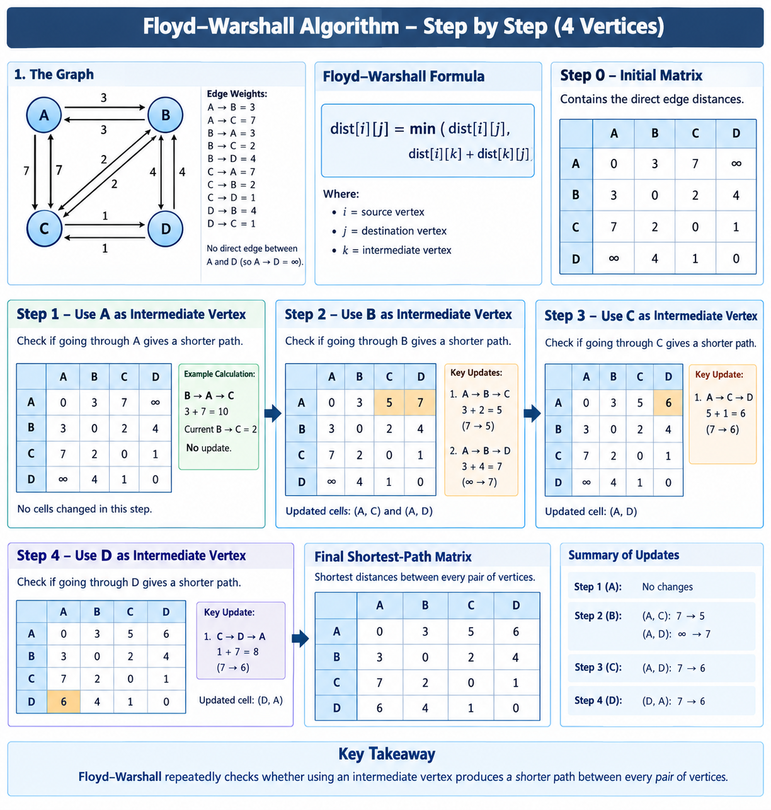
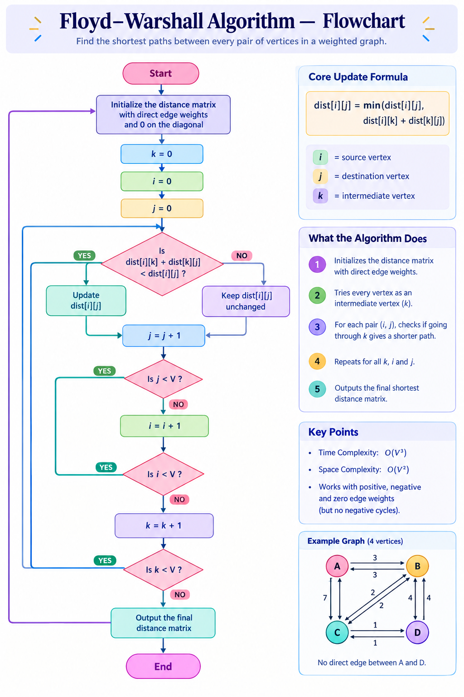

# Project Documentation
## Floyd-Warshall All-Pairs Shortest Path

## 1. Introduction

This project was developed as part of the Dynamic Programming unit to
implement and visualize the Floyd-Warshall algorithm for finding the shortest
paths between every pair of vertices in a weighted graph.

The objective was not only to implement the algorithm, but also to understand
its working process and represent the intermediate steps visually.

---

## 2. Initial Idea

The project started with the problem of finding the shortest distance between
all pairs of vertices in a graph.

Instead of finding the shortest path from only one source vertex, the
Floyd-Warshall algorithm considers every possible source-destination pair.

The main idea we explored was:

> Can a shorter path from `i` to `j` be obtained by passing through an
> intermediate vertex `k`?

This idea forms the basis of the Floyd-Warshall algorithm.

---

## 3. Planning the Solution

We first represented the graph using a distance matrix.

The graph contains four vertices:

`V1, V2, V3, V4`

Directly connected vertices were assigned their corresponding edge weights,
while unreachable vertices were represented using `∞`.

The initial matrix was:

|   | V1 | V2 | V3 | V4 |
|---|---:|---:|---:|---:|
| V1 | 0 | 3 | ∞ | 7 |
| V2 | 8 | 0 | 2 | ∞ |
| V3 | 5 | ∞ | 0 | 1 |
| V4 | 2 | ∞ | ∞ | 0 |

---

## 4. Algorithm Development

The next step was to translate the idea into an algorithm.

The algorithm considers every vertex as an intermediate vertex and checks
whether travelling through that vertex produces a shorter path.

The core update is:

`dist[i][j] = min(dist[i][j], dist[i][k] + dist[k][j])`

Three nested loops were used:

- `k` – intermediate vertex
- `i` – source vertex
- `j` – destination vertex

The detailed algorithm and pseudocode are documented separately in:

[`algorithm.md`](../algorithm/algorithm.md)

---

## 5. Implementation

After defining the algorithm, it was implemented in Python.

The implementation was created in:

`code/Project8_FloydWarshall.py`

The program initializes the distance matrix and performs the three nested
loops required by Floyd-Warshall.

An important part of the implementation was retaining the intermediate
matrices so that the changes produced at each stage could be observed rather
than displaying only the final result.

---

## 6. Step-by-Step Processing

The algorithm was executed by considering the vertices one at a time as
intermediate vertices.

The matrices produced were:

- `D(0)` – initial matrix
- `D(1)` – after considering `V1`
- `D(2)` – after considering `V2`
- `D(3)` – after considering `V3`
- `D(4)` – after considering `V4`

This helped us observe how previously unreachable or longer paths could become
shorter through intermediate vertices.

---

## 7. Visualization

To make these changes easier to understand, a matrix-based visualization was
created.

The visualization represents the progression from the initial matrix to the
final shortest-path matrix and highlights the changes occurring during the
algorithm.



A flowchart was also created to represent the execution flow of the algorithm.



---

## 8. AI-Assisted Development

AI tools were used as part of the project development process for generating
and refining supporting material.

Separate prompts were prepared for:

- Algorithm generation
- Python code generation
- Visualization generation
- Flowchart generation

The prompts used during the process are available in the `prompts/` folder.

This allowed the algorithm, implementation, and visual explanations to be
developed as separate but connected components.

---

## 9. Presentation

After completing the implementation and visualizations, the project was
summarized in a PowerPoint presentation.

The presentation focuses on:

- The problem
- Initial distance matrix
- Floyd-Warshall idea
- Update formula
- Matrix progression
- Final shortest-path matrix
- Pseudocode
- Complexity
- Key takeaway

The presentation is available in:

`presentation/Floyd_Warshall.pptx`

---

## 10. Final Result

The final shortest-path matrix obtained after considering all vertices as
intermediate vertices was:

|   | V1 | V2 | V3 | V4 |
|---|---:|---:|---:|---:|
| **V1** | 0 | 3 | 5 | 6 |
| **V2** | 5 | 0 | 2 | 3 |
| **V3** | 3 | 6 | 0 | 1 |
| **V4** | 2 | 5 | 7 | 0 |

The final matrix represents the shortest distance between every pair of
vertices.

---

## 11. Project Organization

The project was organized into separate folders so that each part of the
work could be easily identified.

```text
algorithm/       → Algorithm and pseudocode
code/            → Python implementation
documentation/   → Project development documentation
presentation/    → Final presentation
prompts/         → AI prompts used during development
visualization/   → Matrix visualization and flowchart